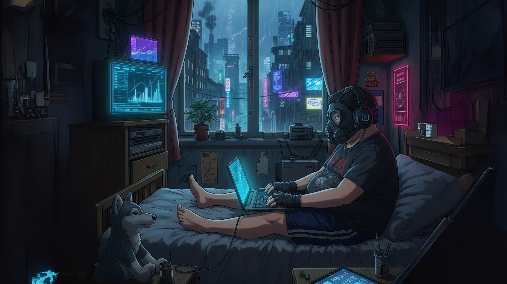

  
  

  
  # 👋 Hey, I'm Kieran.

  💻 College student passionate about programming and ethical hacking.

---
  
## 📚 About Me:

- 🎓 **Currently studying:** Nothing at the moment due to waiting for my new course to start.  
- 🛠️ **Building projects with:** React, Node.js, HTML, CSS, Javascript, Python, and C++.  
- 🌱 **Learning:** Strengthing my python and C++ for my interest in cyber security.
- 💡 **Interests:** Ethical Hacking, A.I, and programming 
- 📫 **Reach me at:** [Portfolio](your-portfolio-link) • [LinkedIn](your-linkedin-link) • [GitHub](your-github-link)

### ⚡ Fun Facts About Me  
- 🎮 Gamer at heart (currently undertaking the task of completing The Legend Of Zelda Tears of The Kingdom in its entirity).  
- 📚 Lifelong learner — currently exploring cloud computing and a miriad of things.

### 🎨 Beyond Code  
- 🎶 Music keeps me focused. My go-tos include: Sleep Token, Linkin Park, Evanescence, Depeche Mode, Panic! at the Disco, Fall Out Boy, My Chemical Romance, Paramore, Halsey, and The Cure.  
- 🎬 Always up for a good sci-fi, horror, or mystery movie.  
- 📺 Favorite TV shows: Doctor Who, Torchwood, Dexter, American Horror Story, and Pokémon.  
- 📷 Enjoy capturing scenery photography in my free time.  

### 🧑‍💻 My Coding Philosophy  
- 🧹 Clean, maintainable code > quick hacks or copy-pasting AI snippets.  
- 🤝 Clear communication is key when building projects and collaborating.  
- 🚀 Build things that solve real problems.  
- 🌱 Always improving — every project is a chance to learn something new.

### 🏆 Highlights  
- 🎓 Earned a Merit in the Bebras Computing Challenge at college (2025).  
- 🌐 Built my first portfolio website from scratch using HTML, CSS, JavaScript, and Bootstrap, going beyond the assignment requirements.  

---

## 🧰 Languauges & Tools:
  
  

    
    
    
    
    
    
    
    
    
    
    
  

---

## 📊 My Stats:

  <picture>
    <source media="(prefers-color-scheme: dark)" srcset="https://github-readme-stats.vercel.app/api?username=KieranPritchard&show_icons=true&theme=holi">
    
  </picture>

 <picture>
    <source media="(prefers-color-scheme: dark)" srcset="https://github-readme-stats.vercel.app/api/top-langs/?username=KieranPritchard&theme=holi">
    
  </picture>

  <picture>
    <source media="(prefers-color-scheme: dark)" srcset="https://streak-stats.demolab.com?user=KieranPritchard&theme=holi-theme">
    
  </picture>

---

<!---
KieranPritchard/KieranPritchard is a ✨ special ✨ repository because its `README.md` (this file) appears on your GitHub profile.
You can click the Preview link to take a look at your changes.
--->
